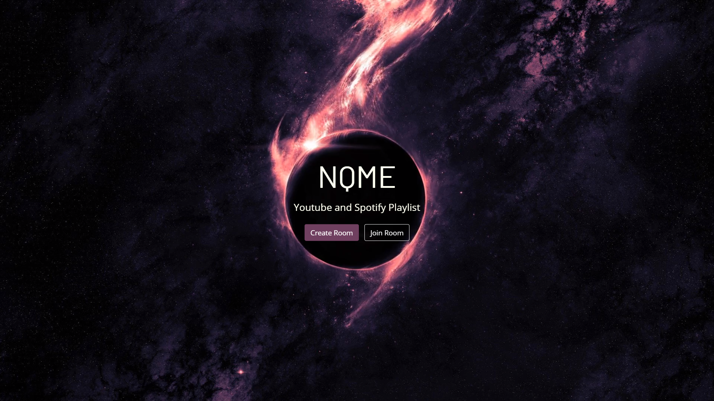
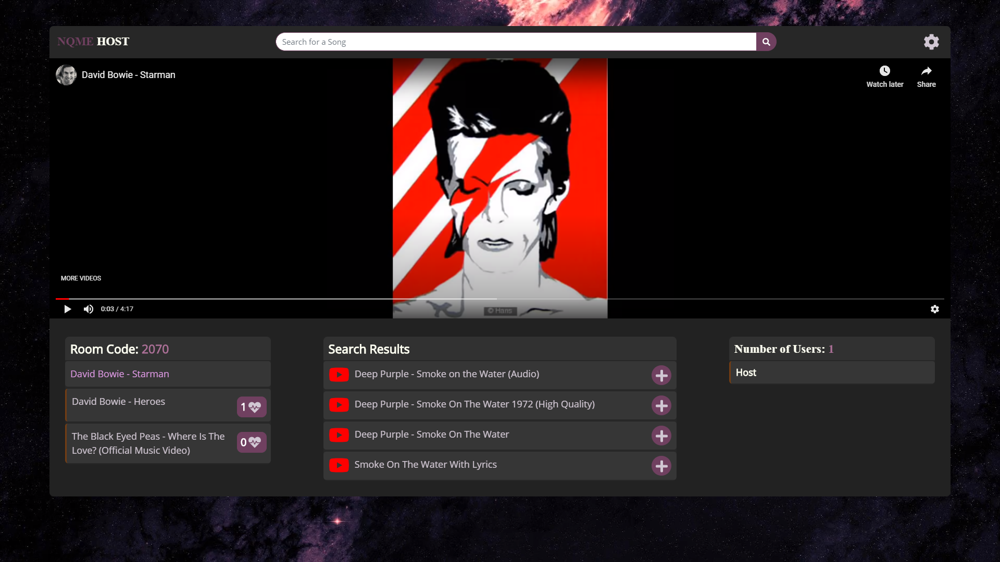
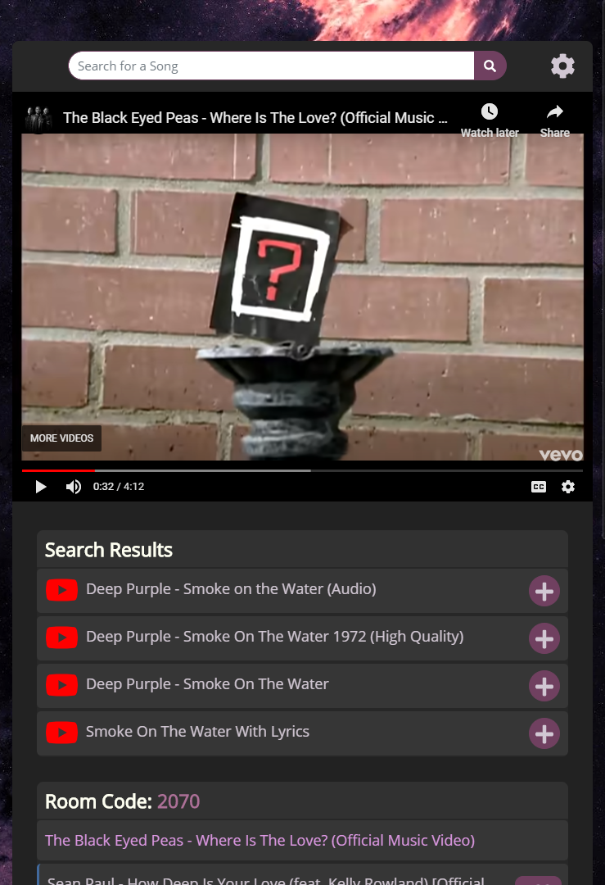
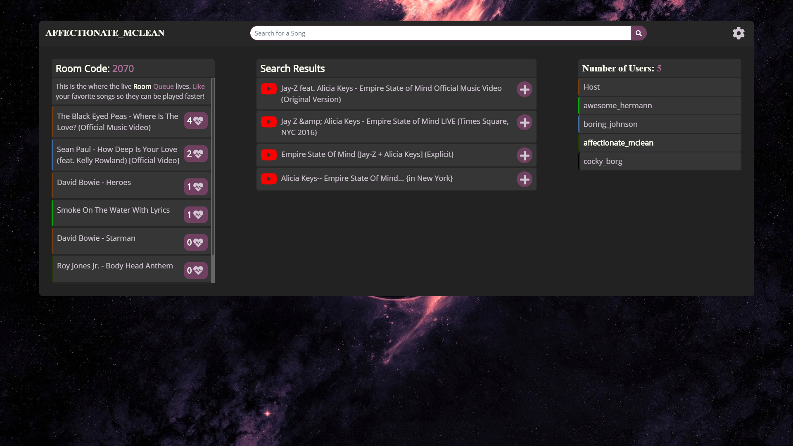
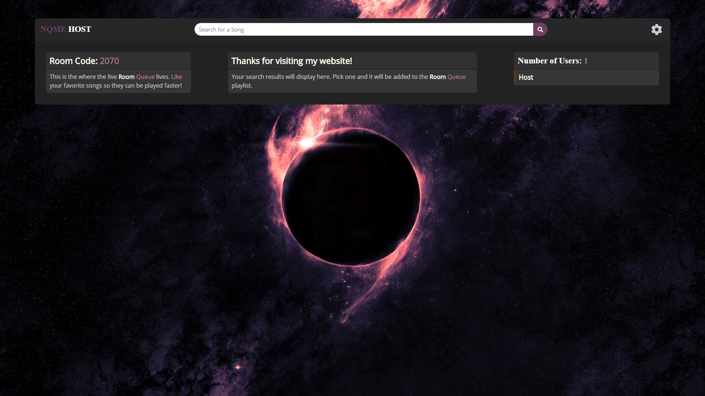

# NQME - Shared Music Playlist

## Links
- **Live application:** [NQME](http://nqme.co.uk)
- Backend API hosted on Heroku Dyno: [NQME GraphQL API](https://nqme-graphql.herokuapp.com/graphql?query=query%7B%0A%20%20rooms%20%7B%0A%20%20%20%20pin%0A%20%20%20%20usernames%0A%20%20%20%20songs%20%7B%0A%20%20%20%20%20%20title%0A%20%20%20%20%20%20url%0A%20%20%20%20%20%20likes%0A%20%20%20%20%20%20username%0A%20%20%20%20%20%20company%0A%20%20%20%20%7D%0A%20%20%7D%0A%7D)
- Python backend repository: [Backend Source Code](https://github.com/SpasZahariev/graphql-flask-server)
- React frontend repository: [Frontend Source Code](https://github.com/SpasZahariev/nqme-react)

## Description
- Responsive Web Application where multiple users can create a room, add music from Youtube and have it play on the room host's device. 
- Users can add likes to queued up songs.
- The Playlist is sorted and updated in real time based on the songs with the most user likes.
- Users can create their own room or join an existing one by entering a 4 digit code.

## Technologies used
- React
- Typescript
- GraphQL - providing data to users from the backend
- Socket IO - two way communication with clients
- Python 3
- Flask - to make python webserver
- Grpahene - Python Library for making GraphQL APIs
- Docker - backend is hosted in a container
- Heroku - hosts backend
- AWS S3 - hosts frontend
- AWS Cloudfront
- SSL certificates

## Setup project locally

1. In the backend directory, run `docker build --tag nqme-backend .`
2. Now you should have a built docker image. Start it with `docker run --publish 5000:5000 nqme-backend`
3. You should have the backend running on **localhost:5000**
4. Go to the frontend directory and run `npm install`
5. Finally, run `npm start`

## Pictures fromo application

